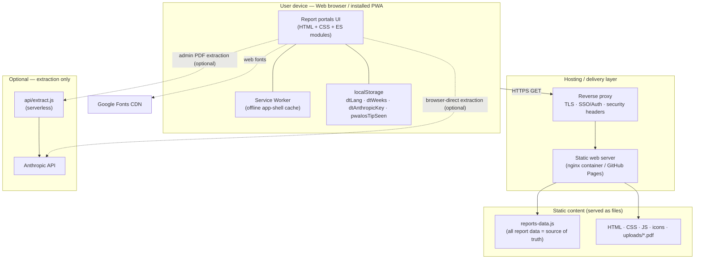
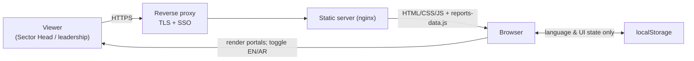
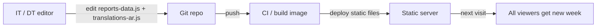
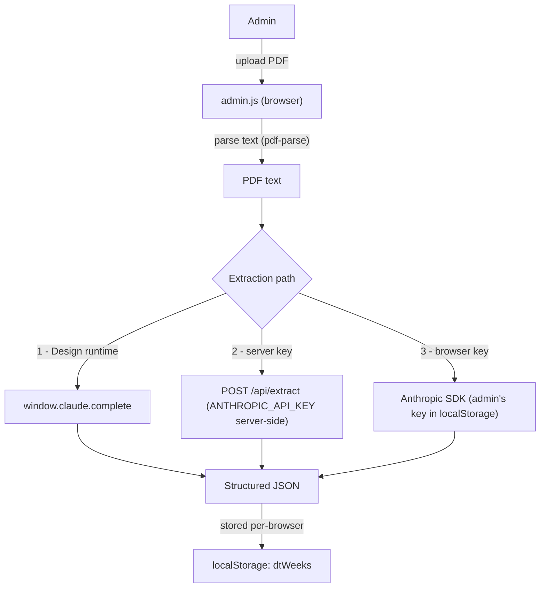
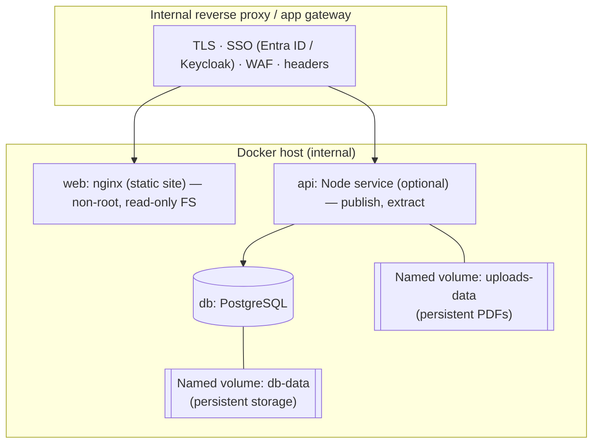

# High-Level Design (HLD) — Executive Report Web Platform

**Ministry of Cabinet Affairs — Digital Transformation Department**
Prepared for: IT & Cybersecurity review · Classification: **Internal / Confidential**

| Field | Value |
|---|---|
| System name | Executive Report Web Platform |
| Owner | Digital Transformation Department (DT) |
| Document type | High-Level Design (HLD) |
| Version | 1.0 |
| Repository | `github.com/TXLABtesting/-Executive-Report-Web-Platform` |
| Current demo | `https://txlabtesting.github.io/-Executive-Report-Web-Platform/` (public GitHub Pages — demo only) |

> **Key statement for Cybersecurity:** in its current form the application is a
> **static, client-side web app** with **no backend, no database, and no built-in
> authentication**. All report content is delivered as static files and rendered in
> the browser. **Confidentiality is therefore enforced by the hosting/network layer**
> (internal network + reverse proxy + SSO/TLS), not by the application itself. The
> recommended internal deployment in §9 adds those controls.

---

## 1. System overview and purpose

The platform presents the department's **weekly executive reports** to the Sector Head
and leadership through a bilingual (English / Arabic, full RTL) web interface. It
replaces distributing raw PDFs by rendering the same information as navigable,
filterable, mobile-friendly report portals.

Three report portals are exposed from a landing page:

- **WGS Weekly Status Report** — meetings, workstream timeline, AI & Security deep dive, decisions & risks, action items.
- **Ministry Project & Demand** — Project & Demand items whose Entity/Sector is **not** `CSS`.
- **CSS Project & Demand** — Project & Demand items whose Entity/Sector is exactly `CSS`.

The site is also an installable **Progressive Web App (PWA)** — it can be added to a
phone/desktop home screen and viewed offline.

## 2. Main system components

| # | Component | Responsibility |
|---|---|---|
| C1 | **Landing page** (`index.html`, `home.js`) | Entry point; renders the report portal cards. |
| C2 | **Project & Demand portals** (`ministry-…`, `css-…` + `pd-report.js`) | One shared renderer; splits the P&D dataset into two portals, computes stats, filters, renders sections and "share as image". |
| C3 | **WGS portal** (`wgs-weekly-status.html`, `wgs-report.js`) | Renders the WGS weekly status report. |
| C4 | **Content model** (`reports-data.js`) | **Single source of truth** — all report data, portal-routing rules, status colours, theme tokens. |
| C5 | **Localization** (`translations-ar.js`, `common.js`) | Arabic dictionary and language/RTL switching. |
| C6 | **Admin publishing** (`admin-upload.html`, `admin.js`) | Optional self-service publishing of a new weekly report from a PDF (client-side; see §11). |
| C7 | **Viewer** (`report-viewer.html`, `viewer.js`) | Detail view for uploaded PDFs without extracted content. |
| C8 | **PWA layer** (`manifest.webmanifest`, `sw.js`, `pwa.js`, `icons/`) | Installability + offline caching (service worker). |
| C9 | **Extraction API** (`api/extract.js`) | *Optional* serverless function that converts report PDF text → structured JSON via the Anthropic API. Not required for viewing. |
| C10 | **Static assets** (`report.css`, `uploads/*.pdf`, fonts) | Styles and the original PDFs offered for download. |

## 3. Technology stack

| Layer | Technology |
|---|---|
| Frontend | Plain **HTML5 + CSS3 + JavaScript (ES modules)** — **zero build**, no framework, no bundler |
| Styling | CSS custom properties (theme tokens); Google Fonts (IBM Plex Sans/Arabic, Space Grotesk) with system fallbacks |
| PWA | Web App Manifest + Service Worker (Cache API) |
| Data | Static JavaScript module (`reports-data.js`); browser `localStorage` for per-user state |
| Optional serverless | Node.js function (`api/extract.js`) using `@anthropic-ai/sdk` (only dependency) |
| Optional client libraries (admin page only) | `pdf-parse` and the Anthropic SDK loaded on demand from the jsDelivr CDN |
| Source control / CI | Git / GitHub; GitHub Actions workflow for GitHub Pages (demo) |
| Recommended internal hosting | **Docker** (nginx static container) behind a reverse proxy — see §9 |

There is **no application server, no database, and no server-side session** in the
current build.

## 4. Architecture diagram



## 5. Data flow diagram

**(a) Report viewing (primary flow — read-only, no server logic):**



**(b) Weekly content update (current operating model):**



**(c) Optional admin PDF → content extraction (client-initiated):**



## 6. User roles and permissions

| Role | Access | Enforced by |
|---|---|---|
| **Viewer** (Sector Head, executives, staff) | Read-only access to all portals and PDFs | *Currently:* network access only (no in-app login). *Recommended:* SSO at the reverse proxy. |
| **Admin / Publisher** | Publish a new weekly report via the admin page | *Currently:* none — the admin page is a normal link and stores data **only in the operator's own browser**. *Recommended:* SSO group membership (write role) + server-side backend. |
| **Editor / IT** | Author `reports-data.js`, deploy | Git repository permissions + deployment pipeline access |
| **Operator / IT Ops** | Run and maintain the container(s) | OS / Docker / infrastructure access |

The application does **not** implement role-based access control internally; there are
no accounts, passwords, or sessions in the current build. Access segregation must be
provided by the hosting environment (see §8, §9, §10).

## 7. Data storage approach

| Data | Where it lives (current) | Notes |
|---|---|---|
| Report content (weekly data) | **`reports-data.js`** (static file in the deployment) | Versioned in Git; changing it + redeploy publishes a week. |
| Arabic translations | `translations-ar.js` (static) | Keyed by English source strings. |
| Original PDFs | `uploads/*.pdf` (static) | Served for download. |
| Per-user UI state | Browser **`localStorage`** — `dtLang` (language), `dtWeeks` (locally uploaded weeks), `dtAnthropicKey` (admin's optional API key), `pwaIosTipSeen` | Never leaves the device; not shared between users. |
| Offline cache | Service Worker Cache (app shell) | For offline viewing only. |

**There is no database today.** For a **shared, multi-user publishing** workflow
(where an admin's upload is visible to everyone), the recommended target adds a small
API + relational database — see §9. The data shapes in `reports-data.js` map cleanly
to database tables (report → sections → groups → items).

## 8. Hosting / deployment approach (overview)

- **Current demo:** GitHub Pages (public HTTPS) — for demonstration only; not for confidential production use.
- **Recommended production:** host **internally** on the ministry network in a
  **Docker** container (nginx serving the static files), placed **behind the ministry's
  reverse proxy / application gateway** that provides **TLS termination, SSO
  authentication, and security headers**. No inbound public exposure.
- The site is fully static, so it can also be dropped onto any internal web server,
  file share behind a web server, or object storage + CDN. Docker is recommended for
  reproducibility and isolation.

Full internal Docker instructions are in **§13 (Deployment notes for IT)**.

## 9. Recommended internal architecture (with persistent database)

For shared publishing and an audit trail, the following target architecture is
recommended. The **web tier works today**; the **API + database tier is a documented
extension** (the backend service is to be built; the frontend data model already
matches it).



- **Persistent storage:** PostgreSQL data is kept on a Docker **named volume**
  (`db-data`) so data survives container restarts, image upgrades and redeploys.
  Uploaded PDFs use a second volume (`uploads-data`). Both are backed up by IT.
- The web container is **stateless** and can be replaced/scaled freely.

## 10. Security considerations

1. **No in-app access control (by design, current build).** All report content is in
   static files readable by anyone who can reach the site. **Mitigation:** serve only on
   the internal network, behind SSO + TLS; never expose publicly. The public GitHub
   Pages demo must not carry real confidential data.
2. **Transport security.** Enforce **HTTPS/TLS** at the reverse proxy (also required for
   PWA install/offline). HSTS recommended.
3. **Security headers** (set at nginx/reverse proxy — see `deploy/nginx.conf`):
   `Content-Security-Policy`, `X-Content-Type-Options: nosniff`, `X-Frame-Options`
   / `frame-ancestors`, `Referrer-Policy`, `Permissions-Policy`. Recommend
   **self-hosting the web fonts** internally to allow a strict CSP with no external origins.
4. **Content Security Policy.** Scripts are external ES modules (`script-src 'self'`);
   the UI uses inline `style` attributes (`style-src 'self' 'unsafe-inline'`). Current
   external origins: Google Fonts (`fonts.googleapis.com`, `fonts.gstatic.com`) and — on
   the admin page only, when browser-side extraction is used — the jsDelivr CDN and the
   Anthropic API. Self-hosting fonts and disabling browser-side extraction removes all
   external origins.
5. **Output encoding / XSS.** All dynamic values are HTML-escaped via a central `esc()`
   helper before insertion into the DOM. Report content is **authored internally
   (trusted)**, not user-generated. Any future user-supplied input must remain escaped.
6. **Secrets.** No secrets are embedded in the static site. The optional extraction API
   reads `ANTHROPIC_API_KEY` from the **server environment** (never sent to the browser).
   The browser-direct extraction path stores an admin-supplied key in that admin's
   `localStorage` — **not recommended on shared machines**; prefer the server-side key
   or manual editing.
7. **Data at rest / privacy.** Content is departmental executive reporting (project
   names, statuses, staff first names as PMs). No citizen PII, no credentials, no
   payment data. Classify as **Confidential – Internal**.
8. **Client storage.** `localStorage` holds only UI preferences and locally-uploaded
   drafts; it is per-device and cleared with browser data. Advise operators not to store
   API keys on shared browsers.
9. **Supply chain.** The website has **no runtime npm dependencies**. The only package
   (`@anthropic-ai/sdk`) is used solely by the optional serverless function. Pin image
   digests and scan images (see §13).
10. **Container hardening.** Run the web container as **non-root**, **read-only root
    filesystem**, `no-new-privileges`, and drop capabilities (see `docker-compose.yml`).
11. **Availability.** Static content is low-risk; the service worker also lets already-
    loaded clients keep working if the origin is briefly unavailable.

## 11. Authentication approach

- **Current build:** none in the application (no login, sessions, or accounts).
- **Recommended:** front the application with the ministry **Single Sign-On** (e.g.,
  Microsoft Entra ID or Keycloak) via the reverse proxy / an identity-aware proxy
  (e.g., `oauth2-proxy`). Viewer access = authenticated staff; **Admin/publish** access =
  a specific SSO group. This adds authentication and coarse authorization **without
  changing the application code**, because the app trusts the network boundary.
- **Extraction API (if deployed):** protect `/api/extract` behind the same proxy;
  keep `ANTHROPIC_API_KEY` server-side only.

## 12. External integrations

| Integration | Purpose | When used | Notes for review |
|---|---|---|---|
| **Google Fonts** (`fonts.googleapis.com`, `fonts.gstatic.com`) | Web fonts | Every page | Has system-font fallback; **recommend self-hosting** to remove the external dependency. |
| **jsDelivr CDN** (`cdn.jsdelivr.net`) | Loads `pdf-parse` + Anthropic SDK on demand | **Admin page only**, when browser-side extraction is used | Not used for viewing; can be disabled by not using browser-side extraction. |
| **Anthropic API** | PDF → structured report JSON | **Optional extraction only** | Outbound only; key stays server-side (preferred) or in the admin's browser. Models referenced: `claude-opus-4-8`, `claude-haiku-4-5`. |
| **GitHub / GitHub Pages** | Source control & the public demo | CI/CD & demo | Demo is public — do not host confidential data there. |

No inbound integrations, webhooks, or third-party callbacks. No analytics/telemetry, no
trackers, no third-party cookies.

## 13. Deployment notes for the IT team (internal Docker hosting)

The application is a folder of static files. Host it internally as a hardened nginx
container behind the ministry reverse proxy.

**Files provided in the repo:** `Dockerfile`, `deploy/nginx.conf`, `docker-compose.yml`,
`.dockerignore`.

**Build & run (web only — ready today):**

```bash
# from the repository root, on the internal Docker host
docker compose build
docker compose up -d            # serves the static site on 127.0.0.1:8080
# then point the internal reverse proxy (TLS + SSO) at http://<host>:8080
```

The `web` container runs **non-root**, with a **read-only root filesystem** and
`no-new-privileges`. Expose it only to the reverse proxy (bind to `127.0.0.1` or an
internal network), never directly to users.

**Optional — shared publishing backend with a persistent database:**
`docker-compose.yml` defines `db` (PostgreSQL) and `api` services under the `full`
profile. PostgreSQL data is stored on the **named volume `db-data`**, and uploaded PDFs
on `uploads-data`, so both **persist across restarts and redeploys**:

```bash
docker compose --profile full up -d      # starts web + db (+ api once built)
docker volume ls                          # shows <project>_db-data, <project>_uploads-data
```

> Note: the `api` image is a **placeholder** for a small publishing/extraction service
> that is **not yet implemented**. Enable it once built. The database and its persistent
> volume can be provisioned now so IT can validate storage, backup and restore.

**Operations checklist:**
- Terminate TLS and enforce SSO at the reverse proxy; add HSTS and the security headers
  from `deploy/nginx.conf` (or the proxy).
- **Backups:** snapshot the `db-data` and `uploads-data` volumes (e.g., `pg_dump` +
  volume backup) on the ministry backup schedule.
- **Updates:** rebuild the image and `docker compose up -d`; then **bump `VERSION` in
  `sw.js`** so returning clients refresh their offline cache.
- **Image hygiene:** pin base images by digest, scan images (Trivy/Grype), run as
  non-root, keep the host patched.
- **Fonts:** for a strict, origin-free CSP, self-host the two font families and update
  the `<link>` tags.

## 14. Assumptions, limitations and dependencies

**Assumptions**
- The application is hosted **internally** behind the ministry reverse proxy providing
  **TLS + SSO**; it is not exposed to the public internet.
- Report content is authored by trusted internal staff.
- Modern evergreen browsers (Chrome/Edge, Safari, Firefox) are used.

**Limitations**
- No built-in authentication, authorization, sessions, or audit log (relies on the
  hosting layer).
- No shared server-side storage today; admin uploads are **per-browser** only.
- Automatic PDF extraction requires AI (Anthropic API) — otherwise weeks are published
  by editing `reports-data.js`.
- PWA offline/install requires HTTPS.

**Dependencies**
- Reverse proxy / SSO (IdP) provided by the ministry.
- Docker host on the internal network (for the recommended deployment).
- Google Fonts / jsDelivr CDN **unless** fonts are self-hosted and browser-side
  extraction is disabled (recommended for a locked-down environment).
- Anthropic API + `ANTHROPIC_API_KEY` **only** if server-side extraction is enabled.

---

*End of document. For the development & data-update guide see `HANDOVER.md`; for the
Arabic extraction note see `IT-EXTRACTION-BRIEF-AR.md`.*
